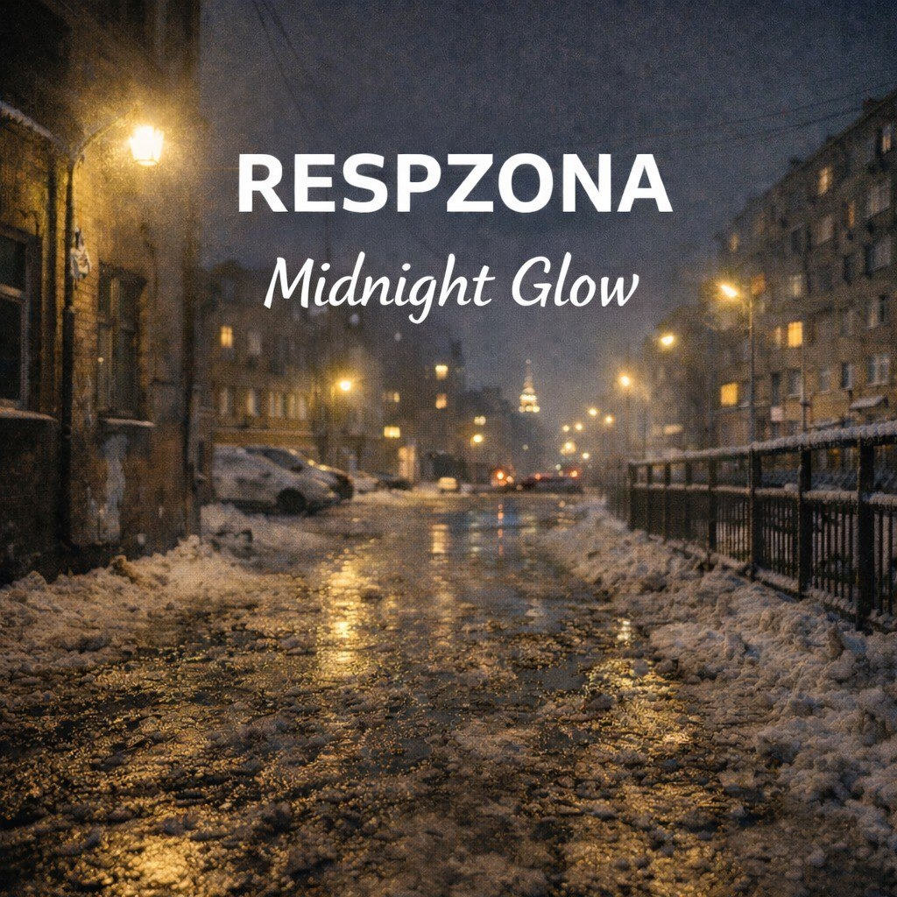

<!DOCTYPE html>
<html lang="ru">
<head>
<meta charset="UTF-8">
<meta name="viewport" content="width=device-width, initial-scale=1.0">
<title>Respzona - Official Website</title>

</head>
<body>

<canvas id="star-canvas"></canvas>

<!-- LANGUAGE TOGGLE -->

    <button class="lang-btn active" onclick="setLanguage('ru')" id="btn-ru">РУ</button>
    <button class="lang-btn" onclick="setLanguage('en')" id="btn-en">EN</button>

<button class="chatbot-btn" id="chatbotBtn" onclick="toggleAI()">
    
</button>

    <h3 style="color:var(--color-primary)">🤖 RESP AI</h3>
    
Система в разработке...

    
ИИ группы скоро будет доступен.

    <header>
        

            
        

        

            <h1>RESPZONA</h1>
            
POP / RAP / PHONK / MEME

        

    </header>

    <main>
        

            <h2 id="about-title">🎵 О нас</h2>
            
Respzona — музыкальная команда из Уфы и Стерлитамака...

            
Для нас важно, чтобы треки были и про эмоции...

        

        

            <h2 id="releases-title">🔥 Наши релизы</h2>
            
Нажми на обложку, чтобы узнать подробности.

            

                

                    
                    
<strong>HUDAY</strong>

                

                

                    
                    
<strong>HUDAY PHONK</strong>

                

                

                    
                    
<strong>WORLD RUN</strong>

                

                

                    
                    
<strong>MIDNIGHT GLOW</strong>

                

            

        

        

            <h2 id="members-title">👥 Участники Respzona</h2>
            

                

                    Aryx
                    <h3 id="aryx-name">Арсен</h3>
                    
Основатель и главный идеолог...

                    
👆 Подробнее

                

                

                    Nng
                    <h3 id="nng-name">Дамир</h3>
                    
Главный идеолог...

                    
👆 Подробнее

                

                

                    nRIS
                    <h3 id="nris-name">Радмир</h3>
                    
Помощник проекта...

                    
👆 Подробнее

                

            

        

        

            <h2 id="gallery-title">📸 Визуал</h2>
            

                

                    
                

                

                    
                

            

        

        

            <h2 id="stats-title">📊 Статистика</h2>
            

                
<h3>2025</h3>
Основание

                
<h3>2</h3>
Города

                
<h3>3+</h3>
Релизов

                
<h3>100%</h3>
Вайб

            

        

        <!-- GENERATOR -->
        

            <h2 id="gen-title">🎨 Генератор Обложек</h2>
            
Создай уникальный арт в стиле нашей музыки.

            

                <input type="text" id="fanName" class="gen-input" placeholder="Твой Ник" value="LISTENER">
                <select id="artStyle" class="gen-select">
                    <option value="guitar">🎸 Cyber Guitar</option>
                    <option value="phonk">🚗 Phonk Drift</option>
                    <option value="glitch">👾 Glitch Core</option>
                    <option value="vinyl">💿 Vinyl Retro</option>
                    <option value="space">🌌 Space Mood</option>
                </select>
                <button class="gen-btn" id="gen-btn" onclick="generateCover()">Сгенерировать</button>
            

            <canvas id="coverCanvas" width="800" height="800" style="width:100%; max-width:350px; display:block; margin:20px auto; border:2px solid #fff; box-shadow: 0 0 30px rgba(0,0,0,0.5);"></canvas>
            <button id="download-btn" onclick="downloadCover()" style="background:transparent; border:1px solid #fff; color:#fff; padding:10px; width:100%; cursor:pointer; border-radius:5px;">⬇ Скачать Обложку</button>
        

        

            <h2 id="support-title">💝 Поддержать Группу</h2>
            

                <a href="https://yoomoney.ru/to/4100118663676748" target="_blank" class="support-btn">💰 YooMoney</a>
                <button class="support-btn" onclick="openDonateModal()">💳 Карта</button>
                <a href="https://boosty.to/respzona/donate" target="_blank" class="support-btn" style="background:linear-gradient(45deg, #f97316, #ea580c)">⭐ Boosty</a>
            

        

        

            <h2 id="socials-title">📱 Наши платформы</h2>
            

                <a href="https://t.me/respzonamus_bot" target="_blank" class="link-button">🤖 Telegram Bot</a>
                <a href="https://t.me/RESPZONA" target="_blank" class="link-button">📱 Telegram Channel</a>
                <a href="https://www.youtube.com/channel/UChsMW4vND4KZpFOj-NObNTA" target="_blank" class="link-button">🎬 YouTube</a>
            

        

    </main>

    <footer>
        
© 2026 RESPZONA. Official Website.

        
<a href="mailto:resp.zona@bk.ru" class="email-link">resp.zona@bk.ru</a>

    </footer>

<!-- TRACK MODAL TEMPLATE -->

    

        &times;
        <h2 id="modal-title" style="margin-top:0; color:var(--color-primary); font-size: 2rem;">TRACK</h2>
        

            📅 Date
            🎤 Aryx, Nng
        

        

            
О треке:

            
Desc

        

        <a href="#" id="modal-link" target="_blank" class="youtube-link">▶ Слушать на YouTube</a>
    

<!-- MEMBER MODAL TEMPLATE -->

    

        &times;
        <h2 id="mem-alias" style="margin-top:0; color:var(--color-secondary); font-size: 2.5rem; text-transform:uppercase;">ALIAS</h2>
        <h3 id="mem-name" style="margin-top:-10px; margin-bottom:20px; color:#aaa; font-weight:normal;">Name</h3>
        
        

            
<strong style="color:var(--color-primary);" id="mem-role-label">Роль:</strong> ...

            
<strong style="color:var(--color-primary);" id="mem-inst-label">Инструменты:</strong> ...

            

            
Подробнее:

            
...

        

    

<!-- DONATE MODAL TEMPLATE -->

    

        &times;
        <h2 id="donate-title" style="margin-top:0; color:var(--color-danger); font-size: 2rem;">ПОДДЕРЖКА ПРОЕКТА</h2>
        
Спасибо за ваш интерес к Respzona! 🖤

        
Ваши донаты идут на покупку оборудования...

        
        
2200 7019 4251 1996

        
        <button id="copy-card-btn" onclick="copyCardNumber()" class="support-btn" style="width:100%; margin-top:10px;">📋 Скопировать номер</button>
    

</body>
</html>
